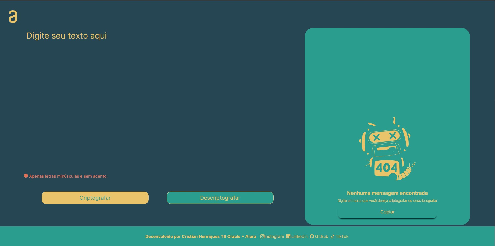

# Desafio Decodificador de Textos

## Concluí o Challenge da Alura + Oracle One, onde o objetivo era desenvolver um encriptador e descriptador de texto. Durante este desafio, utilizei diversas práticas de arquitetura de projetos, organizando os arquivos em pastas de acordo com as melhores práticas de desenvolvimento. Além disso, explorei bastante a lógica de programação, buscando sempre soluções eficientes e elegantes para os problemas propostos.

 🔍 Para estilização, baseei-me em um design fornecido pelo Figma, mas com algumas sutis mudanças, garantindo uma interface agradável e intuitiva para o usuário. Utilizei elementos visuais que foram disponibilizados no design, aplicando-os de forma coesa e harmoniosa no projeto.

 🤝 As interações na comunidade da turma 6 foram fundamentais para o sucesso deste desafio. Trocamos experiências, dicas e feedbacks, o que contribuiu significativamente para o desenvolvimento do projeto. Foi uma experiência próxima de um fluxo de trabalho real, onde tínhamos prazos definidos e um modelo a ser entregue.

 Com a conclusão deste projeto, sinto-me preparado para enfrentar novos desafios e avançar para a próxima fase. Estou animado para aplicar o conhecimento adquirido e continuar aprendendo e crescendo na área de desenvolvimento.

 🚀 Vamos em frente!

#### #challengeonedecodificador5

